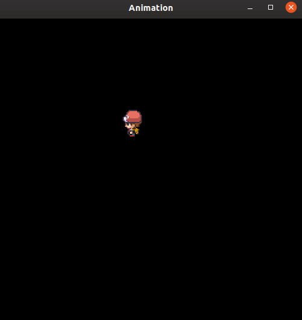
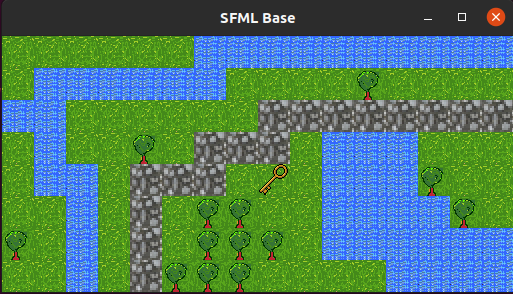
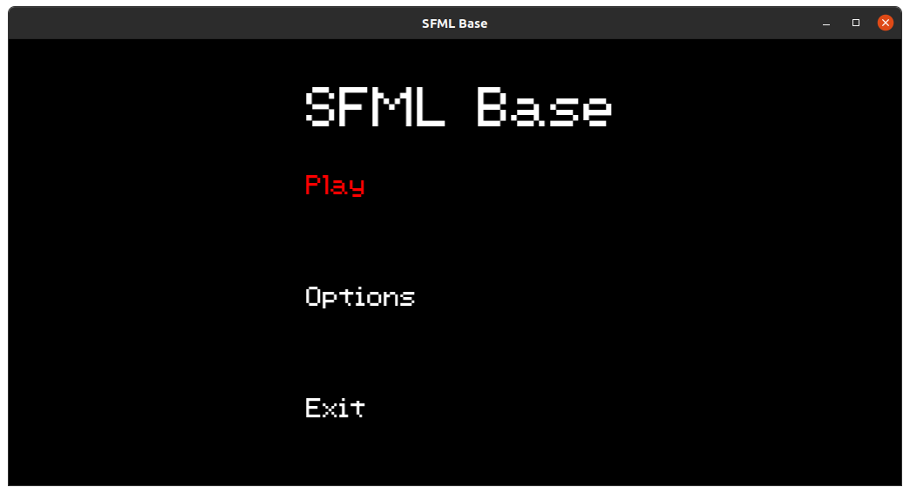

# SFMLBase

Basic code for SFML C++ animation collision and level gen

## Compile

sudo g++ main.cpp source/* -lsfml-graphics -lsfml-window -lsfml-system

## To do
- [x] Animate Sprite
- [x] Put code into classes
- [x] Create home screen
- [x] Add level generation
- [x] Add collision
- [ ] Create levels
- [x] Add item pickup
## Info
Learning C++ and SFML fundamentals to eventually make my own game. Code base is constantly changing with new methods/ideas
## Media

\
\

